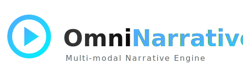

<p align="center">
  
</p>

# 🌟 OmniNarrative (多模态叙事内容生成平台)

<p align="center">
  <em>面向内容创作者的零门槛多模态叙事生成引擎</em>
</p>

## 🚀 项目介绍

**OmniNarrative** 是一个专为内容创作者打造的多模态叙事内容生成平台。它能让灵感轻松转化为丰富的故事、视频脚本和多媒体内容。通过直观的可视化界面和强大的后台算法，平台自动为你分析当前趋势，一键生成高质量、富有感染力的多模态素材！

🎥 **猛戳下方查看完整项目演示视频** 🎥

https://github.com/adam333666/OmniNarrative/raw/main/demo_video.mp4

---

## ✨ 核心亮点

- **🎨 零门槛创作流**：五步输入法，引导式轻松填报，支持所见即所得。
- **📈 实时趋势增强**：内置 B站、知乎等平台热门趋势，实时抓取、智能融合到生成的内容中。
- **🛠 全栈可观测体验**：从生成状态跟进，到重型结果包产出，甚至支持 JSON 和 MD 的一键导出消费。
- **🤖 强大的 AI 编排**：使用 `Instructor + LiteLLM` 进行结构化输出，结合 `LangGraph` 达到稳定可靠的执行与恢复。
- **📦 开箱即用**：前端 Next.js 闭环展示，后端 FastAPI 微服务，配有完整的 Docker Compose，几分钟即可跑起全节点！

---

## 📸 系统预览

*(此处演示仅为示例，可根据实际运行截图替换)*

### 1. 直观的输入与趋势控制台
平台整合了最热门的创作趋势，帮助你在开始创作前就能抓准流量密码。

> `[趋势分析控制台界面截图示例]`

### 2. 多步实时生成状态页
无需焦虑等待！平台实时抛出生成步骤，清晰了解大模型的思考与执行过程。

> `[状态流转与执行引擎截图示例]`

### 3. 重型结果页及多形态分发
生成完毕后，你将获得一个全方位的内容包（包括分镜、脚本、参考），并支持全格式（Markdown、JSON）导出。

> `[丰富多模态结果产出界面截图示例]`

---

## ⚙️ 快速开始

本项目支持一键本地拉起，强烈推荐通过 Docker Compose 进行部署。

### 前提条件

- [Docker & Docker Compose](https://docs.docker.com/compose/)
- Node.js >= 18 (如需本地开发前端)
- Python >= 3.10 (如需本地开发后端)

### 部署步骤

1. **环境配置**：
   复制环境变量示例文件，开箱即用：
   ```bash
   cp .env.example .env
   cp frontend/.env.local.example frontend/.env.local
   cp backend/.env.example backend/.env
   ```

2. **一键启动**：
   ```bash
   docker compose -f deploy/docker-compose.yml up --build -d
   ```
   *稍等片刻，即可通过 `http://localhost:3000` 访问精美的前端界面，API 服务将运行在 `8000` 端口。*

### 本地原生开发

如果你希望进行二次开发，我们为你准备了引导脚本：
```bash
# 安装各个环境依赖
bash scripts/dev_bootstrap.sh

# 运行统一回归测试验证
bash scripts/demo_regression.sh
```

---

## 📚 文档指南

我们的文档结构非常严谨，**文档即事实 (Doc-as-Truth)**，请参考 `docs/` 目录：
- 📖 [项目需求文档 (PRD)](docs/PRD.md)
- 🏗 [功能架构与迭代日志](docs/changelog.md)
- 🧪 [评测与质量检验矩阵](docs/testing/n7_evaluation_sample_matrix.md)

---

## 🤝 参与贡献

欢迎任何形式的贡献！提交 Pull Request 前请确保代码已通过所有的本地测试：
```bash
# 对后端环境进行验证
bash scripts/smoke_test.sh
```

## 📄 开源协议

本项目采用 **MIT License** 开源，您可以自由地使用、修改和分发，但也请保留相关版权声明。一起来让多媒体生成变得更简单吧！
